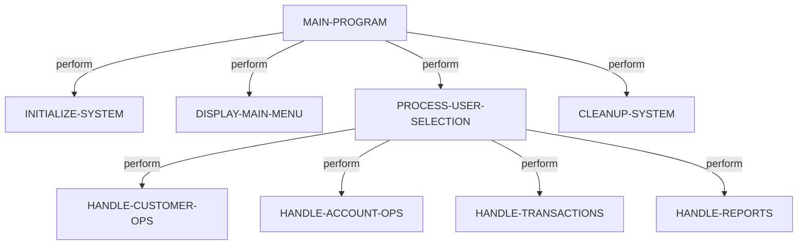
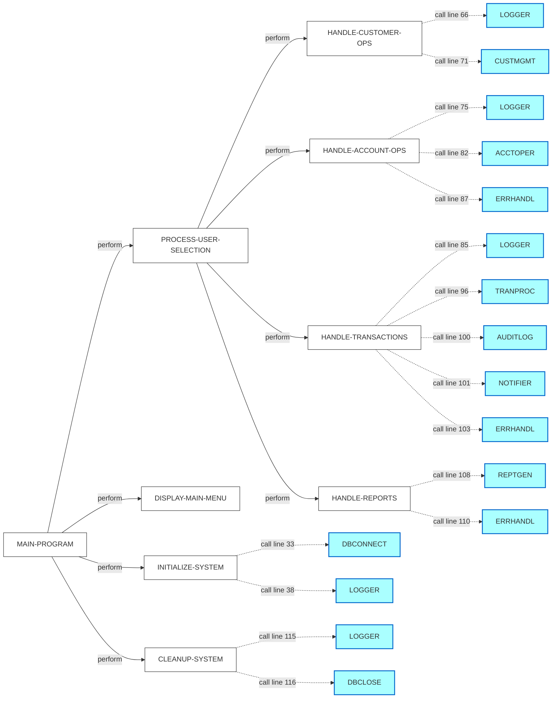
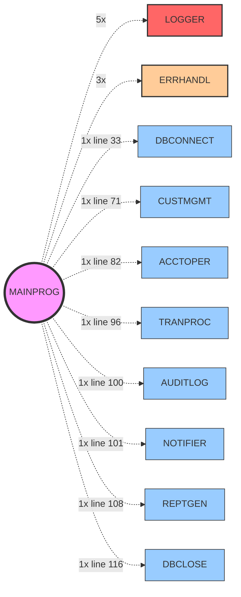
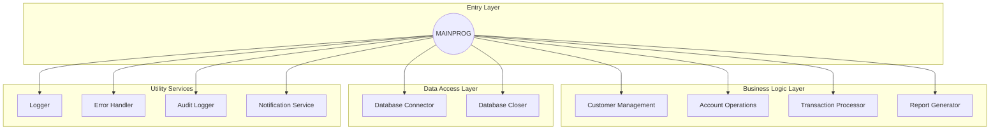
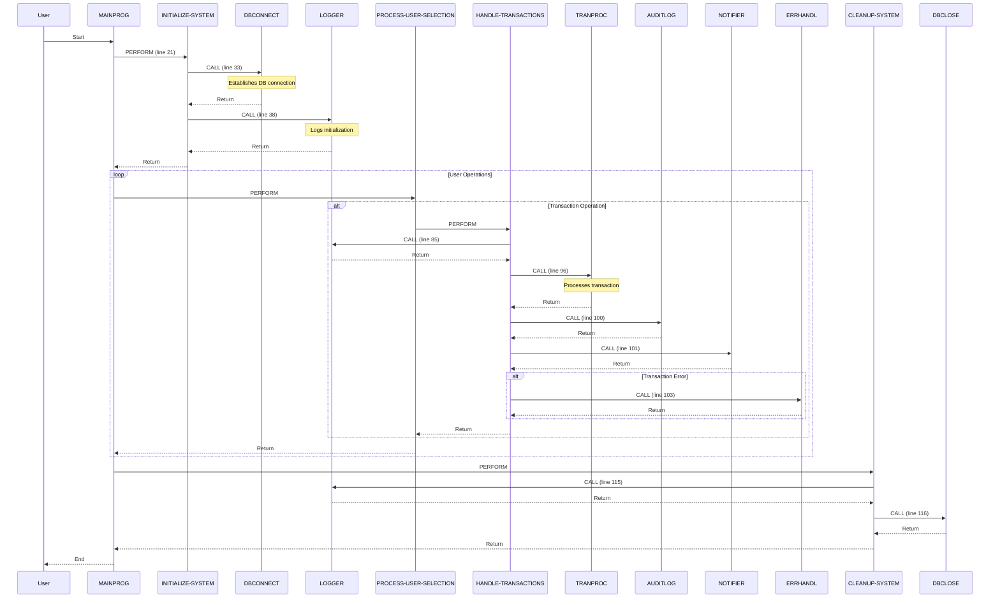

# Before vs After: Documentation Enhancement Comparison

## The Problem You Identified

> "I see the docs were generated, but, `External Calls` in numbers, but does not highlight which were those calls and where it were made to in a mermaid diagram. Wouldn't that be helpful in analyzing the source project?"

---

## BEFORE Enhancement

### Old Control Flow Section
```markdown
### Control Flow

The control flow of `MAINPROG` is depicted in the following diagram:



### External Calls

The program makes several external calls to other programs, including:

- `DBCONNECT` (Line 33)
- `LOGGER` (Lines 38, 66, 75, 85, 115)
- `CUSTMGMT` (Line 71)
- `ACCTOPER` (Line 82)
- `ERRHANDL` (Lines 87, 103, 110)
- `TRANPROC` (Line 96)
- `AUDITLOG` (Line 100)
- `NOTIFIER` (Line 101)
- `REPTGEN` (Line 108)
- `DBCLOSE` (Line 116)
```

**Issues:**
- ❌ Only shows PERFORM relationships, no CALL relationships
- ❌ External calls listed separately as bullet points
- ❌ No visualization of WHERE calls are made FROM
- ❌ No frequency analysis
- ❌ No system-wide context

---

## AFTER Enhancement

### Enhanced Control Flow with External Calls

**1. Combined CFG Diagram** (Mermaid)


**2. External Call Context**
```markdown
### External Calls by Paragraph

#### INITIALIZE-SYSTEM (Line 30)
- Calls **DBCONNECT** at line 33 - Establishes database connection at program startup
- Calls **LOGGER** at line 38 - Logs initialization completion

#### HANDLE-CUSTOMER-OPS (Line 70)
- Calls **LOGGER** at line 66 - Logs customer operation selection
- Calls **CUSTMGMT** at line 71 - Delegates to customer management subsystem

#### HANDLE-ACCOUNT-OPS (Line 79)
- Calls **LOGGER** at line 75 - Logs account operation selection
- Calls **ACCTOPER** at line 82 - Delegates to account operations subsystem
- Calls **ERRHANDL** at line 87 - Handles errors from account operations

#### HANDLE-TRANSACTIONS (Line 91)
- Calls **LOGGER** at line 85 - Logs transaction initiation
- Calls **TRANPROC** at line 96 - Processes financial transaction
- Calls **AUDITLOG** at line 100 - Records transaction for audit trail
- Calls **NOTIFIER** at line 101 - Sends transaction notification
- Calls **ERRHANDL** at line 103 - Handles transaction errors

#### HANDLE-REPORTS (Line 107)
- Calls **REPTGEN** at line 108 - Generates business reports
- Calls **ERRHANDL** at line 110 - Handles report generation errors

#### CLEANUP-SYSTEM (Line 114)
- Calls **LOGGER** at line 115 - Logs cleanup initiation
- Calls **DBCLOSE** at line 116 - Closes database connections
```

**3. Paragraph Complexity Analysis**
```markdown
| Paragraph | Line | Performs | External Calls | Total Edges | Complexity |
|-----------|------|----------|----------------|-------------|------------|
| MAIN-PROGRAM | 21 | 4 | 0 | 4 | Medium |
| INITIALIZE-SYSTEM | 30 | 0 | 2 | 2 | Low |
| PROCESS-USER-SELECTION | 53 | 4 | 0 | 4 | Medium |
| HANDLE-CUSTOMER-OPS | 70 | 0 | 2 | 2 | Low |
| HANDLE-ACCOUNT-OPS | 79 | 0 | 3 | 3 | Medium |
| HANDLE-TRANSACTIONS | 91 | 0 | 5 | 5 | High |
| HANDLE-REPORTS | 107 | 0 | 2 | 2 | Low |
| CLEANUP-SYSTEM | 114 | 0 | 2 | 2 | Low |
```

**Improvements:**
- ✅ Shows both PERFORM and CALL relationships in one diagram
- ✅ Line numbers for every external call
- ✅ Context explaining WHY each call is made
- ✅ Complexity metrics identifying hotspots
- ✅ Visual distinction between internal and external flow

---

## NEW: Call Frequency Heatmap

```markdown
### Call Frequency Analysis

| Program Called | Call Count | Called From Paragraphs | Category |
|----------------|-----------|------------------------|----------|
| LOGGER | 5 | INITIALIZE-SYSTEM, HANDLE-CUSTOMER-OPS, HANDLE-ACCOUNT-OPS, HANDLE-TRANSACTIONS, CLEANUP-SYSTEM | 🔥 Critical |
| ERRHANDL | 3 | HANDLE-ACCOUNT-OPS, HANDLE-TRANSACTIONS, HANDLE-REPORTS | ⚠️ High |
| DBCONNECT | 1 | INITIALIZE-SYSTEM | ℹ️ Medium |
| CUSTMGMT | 1 | HANDLE-CUSTOMER-OPS | ℹ️ Medium |
| ACCTOPER | 1 | HANDLE-ACCOUNT-OPS | ℹ️ Medium |
| TRANPROC | 1 | HANDLE-TRANSACTIONS | ℹ️ Medium |
| AUDITLOG | 1 | HANDLE-TRANSACTIONS | ℹ️ Medium |
| NOTIFIER | 1 | HANDLE-TRANSACTIONS | ℹ️ Medium |
| REPTGEN | 1 | HANDLE-REPORTS | ℹ️ Medium |
| DBCLOSE | 1 | CLEANUP-SYSTEM | ℹ️ Medium |
```

**Insights:**
- ✅ Quickly identifies LOGGER as most critical dependency (5 calls)
- ✅ ERRHANDL is high-frequency error handler (3 calls)
- ✅ Shows which paragraphs depend on each external program

---

## NEW: Program Call Hierarchy



**Insights:**
- ✅ Visual hierarchy showing all dependencies from one program
- ✅ Frequency annotations (5x, 3x, 1x)
- ✅ Color-coded by criticality
- ✅ Line numbers for single calls

---

## NEW: System-Wide Dependencies



**Insights:**
- ✅ Shows architectural layers
- ✅ Identifies utility vs business logic programs
- ✅ Helps understand system design patterns

---

## NEW: Execution Flow Sequence



**Insights:**
- ✅ Shows realistic execution flow with timing
- ✅ Includes loops, conditionals, and error paths
- ✅ Line numbers for every call
- ✅ Notes explaining purpose of each interaction

---

## NEW: Detailed Call Analysis (Per Program)

```markdown
### LOGGER

**This Program's Usage**:
- Call Count: 5
- Called From Paragraphs:
  - INITIALIZE-SYSTEM (line 38)
  - HANDLE-CUSTOMER-OPS (line 66)
  - HANDLE-ACCOUNT-OPS (line 75)
  - HANDLE-TRANSACTIONS (line 85)
  - CLEANUP-SYSTEM (line 115)

**System-Wide Context**:
- Total Calls Across System: 127
- Called By 14 different programs
- Classification: Critical Utility Service

**Purpose & Integration**:
LOGGER is the system-wide logging facility used at key points throughout the application lifecycle. In MAINPROG, it's invoked at every major operation boundary to provide audit trail and debugging information. Its high frequency (5 calls) indicates it's a critical dependency for operational visibility.

---

### ERRHANDL

**This Program's Usage**:
- Call Count: 3
- Called From Paragraphs:
  - HANDLE-ACCOUNT-OPS (line 87)
  - HANDLE-TRANSACTIONS (line 103)
  - HANDLE-REPORTS (line 110)

**System-Wide Context**:
- Total Calls Across System: 89
- Called By 11 different programs
- Classification: High-Frequency Error Handler

**Purpose & Integration**:
ERRHANDL is the centralized error handling facility. In MAINPROG, it's invoked after operations that have high failure potential (account operations, transactions, reports). This pattern ensures consistent error handling and user feedback across all business operations.
```

**Insights:**
- ✅ Shows local vs system-wide usage
- ✅ Explains purpose and integration pattern
- ✅ Identifies criticality based on system-wide data

---

## Summary of Enhancements

| Aspect | Before | After |
|--------|--------|-------|
| **External Call Visualization** | Bullet list only | 5 different diagrams showing context |
| **Line Numbers** | Listed separately | Embedded in diagrams and tables |
| **Calling Context** | Not shown | Documented for each call with purpose |
| **Frequency Analysis** | Not available | Heatmap table with categorization |
| **System-Wide View** | Not available | Architectural layer diagram |
| **Execution Flow** | Static graph | Dynamic sequence diagram with timing |
| **Complexity Metrics** | Not available | Table showing perform/call counts |
| **Integration Patterns** | Not explained | Detailed analysis per program |

---

## Metadata Utilization

### Before
- ❌ `superbol_cfg.calls[]` - Not fully utilized
- ❌ `gnucobol_analysis.call_counts` - Not used
- ⚠️ Only basic paragraph names used

### After
- ✅ `superbol_cfg.calls[]` - Fully utilized (from/to/line)
- ✅ `superbol_cfg.performs[]` - Fully utilized
- ✅ `gnucobol_analysis.call_counts` - System-wide analysis
- ✅ `gnucobol_analysis.program_calls` - Dependency mapping
- ✅ Complete metadata integration

---

*This comparison shows the dramatic improvement in documentation quality by fully leveraging available metadata sources.*
