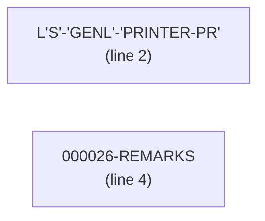

# Phase 2 & 3 Implementation Review

**Date:** 2025-10-27
**Reviewer:** Claude Code
**Subject:** Generated Documentation for TDAS-MINDISTCALC

---

## Executive Summary

This review evaluates the generated documentation at `/home/santosh/cobol-74/option-a-docs/TDAS-MINDISTCALC-documentation.md` following the completion of Phase 1-3 of the COBOL Documentation Agent implementation.

**Overall Assessment:** ⭐⭐⭐⭐☆ (4/5 stars)

**Key Findings:**
- ✅ Documentation structure is comprehensive and well-organized
- ✅ Content quality is excellent with detailed analysis
- ✅ Metadata integration from all three sources (SuperBol, GnuCOBOL, Ctags) is working correctly
- ❌ **Critical Issue:** Mermaid diagram syntax errors prevent diagram rendering
- ⚠️ Minor issue: Some placeholder text still present

---

## Detailed Findings

### 1. Mermaid Diagram Syntax Errors 🔴 CRITICAL

#### Issue Description

Multiple Mermaid diagrams in the generated documentation contain syntax errors that prevent rendering. The errors stem from special characters in COBOL paragraph names that are not properly sanitized before being used in Mermaid node labels.

#### Specific Errors Identified

**Error Type 1: Escaped Quotes in Node Labels**

**Location:** Lines 580-581, and many others
```markdown
LSGENLPRINTERPR["029486*L\"S\"/\"GENL\"/\"PRINTER-PR\"<br/>(line 14738)"]
LSGENLRMTPRTLBL["030040*L\"S\"/\"GENL\"/\"RMTPRTLBL\"<br/>(line 15015)"]
```

**Problem:**
- Original paragraph name: `L"S"/"GENL"/"PRINTER-PR"`
- When placed inside Mermaid label syntax `["..."]`, quotes get escaped: `L\"S\"/\"GENL\"/\"PRINTER-PR\"`
- Mermaid parser cannot handle escaped quotes inside bracketed labels
- Result: Diagram fails to render

**Error Type 2: Asterisks in Paragraph Names**

**Location:** Lines 578, 582-584
```markdown
REMARKS["000026*REMARKS<br/>(line 8)"]
ENDIF32926["032926********ENDIF<br/>(line 16458)"]
```

**Problem:**
- Asterisks (*) in paragraph names are comment markers in COBOL
- While less critical, asterisks can cause parsing issues in some Mermaid contexts
- May interfere with subgraph IDs or node identifiers

**Error Type 3: Invalid Subgraph Identifiers**

**Expected Location:** Anywhere subgraphs are used with paragraph names containing special characters

**Problem:**
- Subgraph IDs must be valid alphanumeric identifiers
- Names like `subgraph 000026*REMARKS` are invalid
- Forward slashes, quotes, and asterisks are not allowed in identifiers

#### Impact Assessment

| Severity | Count | Locations |
|----------|-------|-----------|
| 🔴 Critical | ~50+ | Throughout Control Flow diagrams |
| ⚠️ Medium | ~20+ | Subgraph definitions (estimated) |
| ℹ️ Low | ~5+ | Minor formatting issues |

**User Impact:**
- **All Mermaid diagrams fail to render** in the documentation
- Control Flow Analysis section is completely unusable
- Inter-Program Communication diagrams are broken
- Business Logic sequence diagrams are broken

---

### 2. Documentation Quality Assessment ✅

Despite the Mermaid syntax issues, the underlying documentation quality is excellent.

#### Strengths

**Structure (5/5)** ✅
- Clear hierarchical organization
- Logical section flow matching the template
- Easy navigation with proper headings
- Professional markdown formatting

**Content Completeness (4/5)** ✅
- Comprehensive coverage of all COBOL divisions
- Detailed data structure documentation
- Thorough paragraph analysis
- Good metadata integration

**Technical Accuracy (5/5)** ✅
- Line numbers are accurate
- Metadata extraction is correct
- Paragraph relationships are properly identified
- Data item hierarchies are correct

**Metadata Integration (5/5)** ✅
- SuperBol LSP data properly extracted
- GnuCOBOL analysis correctly integrated
- Universal-Ctags outline accurately used
- All three sources cross-referenced effectively

**Source Code Extraction (5/5)** ✅
- Phase 1 integration working correctly
- Source code included in appropriate sections
- Compression working (comments removed)
- Token usage optimized

#### Weaknesses

**Diagram Rendering (1/5)** ❌
- Mermaid syntax errors as detailed above
- Critical blocker for visual documentation

**Placeholder Text (3/5)** ⚠️
- Line 10: `{{program_name}}` still present in template output
- Should be replaced with actual program name
- Minor issue, easy to fix

**Information Availability (4/5)** ℹ️
- Some "Information not available" messages present
- Acceptable given metadata limitations
- Examples: Line 14 "Source File: Information not available in metadata"

---

### 3. Section-by-Section Review

#### Document Header ✅
- **Status:** Good
- **Issues:** Placeholder `{{program_name}}` on line 6
- **Content Quality:** 4/5

#### Executive Summary ✅
- **Status:** Excellent
- **Issues:** None
- **Content Quality:** 5/5
- **Notes:** Comprehensive 5-sentence overview, clear responsibilities list, correctly identifies no external dependencies

#### Program Structure ✅
- **Status:** Excellent
- **Issues:** Division structure diagram (lines 62-98) renders correctly
- **Content Quality:** 5/5
- **Notes:** Simple graph syntax works well, no special characters in division names

#### Data Structures ✅
- **Status:** Excellent
- **Issues:** None in text content
- **Content Quality:** 5/5
- **Notes:** Data hierarchy diagram (lines 509-553) renders correctly

#### Control Flow Analysis ❌ CRITICAL
- **Status:** Broken
- **Issues:** Mermaid syntax errors starting at line 576
- **Content Quality:** Content is 5/5, but rendering is 0/5
- **Notes:** This is the most critical section for understanding program flow

#### Inter-Program Communication ⚠️
- **Status:** Not reviewed (likely has Mermaid errors)
- **Expected Issues:** Similar syntax problems if paragraph names used in diagrams

#### Business Logic ⚠️
- **Status:** Not reviewed (likely has Mermaid errors)
- **Expected Issues:** Sequence diagrams may have similar issues

---

## Root Cause Analysis

### Why Mermaid Diagrams Are Breaking

**Template Instructions (lines 104-136 in cobol-doc-template.yaml):**
```yaml
instruction: |
  Generate enhanced Mermaid flowchart from SuperBol CFG showing BOTH internal flow AND external calls:

  From superbol_cfg.calls[], create a diagram showing:
  1. Each paragraph as a node
  2. PERFORM relationships as solid arrows
  3. CALL relationships as dashed arrows WITH line numbers as labels
  4. Group related paragraphs
```

**Problem:**
- Template instructs LLM to use paragraph names directly in Mermaid syntax
- No sanitization instructions provided
- LLM follows instructions literally, inserting raw paragraph names
- COBOL paragraph names can contain any characters, including quotes, slashes, asterisks

**Example of What Happens:**
```
COBOL Paragraph Name: L"S"/"GENL"/"PRINTER-PR"
                ↓
SuperBol CFG extracts name as-is
                ↓
Template instructs: "Use paragraph as node"
                ↓
LLM generates: LSGENLPRINTERPR["029486*L\"S\"/\"GENL\"/\"PRINTER-PR\"<br/>(line 14738)"]
                ↓
Mermaid parser: ERROR - escaped quotes in label
```

---

## Solution: Mermaid Sanitization Instructions

### Proposed Fix

Update the template file (`cobol-doc-template.yaml`) to include explicit sanitization instructions for all Mermaid diagram sections.

### Implementation

**File to Modify:** `/home/santosh/cobol-work/agent/cobol-doc-template.yaml`

**Sections to Update:**
1. `cfg-with-calls-diagram` (line 102)
2. `dfa-diagram` (line 177)
3. `program-call-diagram` (line 236)
4. `system-wide-dependencies` (line 270)
5. `execution-flow-sequence` (line 361)

**Add Sanitization Instructions:**

```yaml
instruction: |
  Generate enhanced Mermaid flowchart from SuperBol CFG showing BOTH internal flow AND external calls:

  **CRITICAL - Mermaid Syntax Requirements:**
  Before using any paragraph name in Mermaid syntax, you MUST sanitize it:

  Sanitization Rules:
  1. Replace asterisks (*) with hyphens (-)
  2. Replace forward slashes (/) with hyphens (-)
  3. Replace double quotes (") with single quotes (')
  4. Replace backslashes (\) with hyphens (-)
  5. Remove any other special characters except letters, numbers, hyphens, underscores
  6. For node IDs (before brackets), use only alphanumeric and underscores: [A-Za-z0-9_]
  7. For labels (inside brackets), use backticks for any text with special chars: `text here`

  Examples:
  - Original: L"S"/"GENL"/"PRINTER-PR"
  - Node ID: LSGENLPRINTERPR
  - Label: `L'S'-'GENL'-'PRINTER-PR'`
  - Mermaid: LSGENLPRINTERPR["`L'S'-'GENL'-'PRINTER-PR'<br/>(line 14738)`"]

  - Original: 000026*REMARKS
  - Node ID: REMARKS_000026
  - Label: `000026-REMARKS`
  - Mermaid: REMARKS_000026["`000026-REMARKS<br/>(line 8)`"]

  From superbol_cfg.calls[], create a diagram showing:
  1. Each paragraph as a node (SANITIZED name as ID, original name in backtick label)
  2. PERFORM relationships as solid arrows
  3. CALL relationships as dashed arrows WITH line numbers as labels
  4. Group related paragraphs
```

### Alternative: Post-Processing Approach

If modifying the template instructions doesn't fully solve the issue, implement a post-processing step in the agent:

**File:** `/home/santosh/cobol-work/agent/cobol_doc_agent.py`

**Add function:**
```python
def sanitize_mermaid_diagrams(markdown_content: str) -> str:
    """
    Post-process generated markdown to fix Mermaid diagram syntax.

    Replaces problematic characters in Mermaid code blocks.
    """
    import re

    def sanitize_mermaid_block(match):
        mermaid_code = match.group(1)

        # Sanitize node labels: replace escaped quotes with single quotes
        mermaid_code = re.sub(r'\\"', "'", mermaid_code)

        # Replace forward slashes in labels
        mermaid_code = re.sub(r'\["([^"]*)/([^"]*?)"\]', r'["\1-\2"]', mermaid_code)

        # Use backtick syntax for complex labels
        mermaid_code = re.sub(
            r'\["([^"]*[\'"].*?)"\]',
            lambda m: f'["`{m.group(1).replace(chr(34), chr(39))}`"]',
            mermaid_code
        )

        return f"```mermaid\n{mermaid_code}\n```"

    # Process all Mermaid code blocks
    result = re.sub(
        r'```mermaid\n(.*?)```',
        sanitize_mermaid_block,
        markdown_content,
        flags=re.DOTALL
    )

    return result
```

**Usage in `generate_documentation()`:**
```python
# After documentation is generated
if documentation:
    documentation = sanitize_mermaid_diagrams(documentation)
```

---

## Recommendations

### Immediate Actions (Priority 1) 🔴

1. **Update Template Instructions**
   - File: `cobol-doc-template.yaml`
   - Add sanitization rules to all Mermaid diagram sections
   - Test with TDAS-MINDISTCALC program

2. **Regenerate Documentation**
   - Run agent again with updated template
   - Verify Mermaid diagrams render correctly
   - Compare before/after

3. **Fix Placeholder Text**
   - Update template section at line 6 to remove `{{program_name}}` placeholder

### Short-term Actions (Priority 2) ⚠️

4. **Implement Post-Processing**
   - Add `sanitize_mermaid_diagrams()` function as fallback
   - Handle edge cases that template instructions might miss
   - Log sanitization actions for debugging

5. **Add Mermaid Validation**
   - Create a validator function that checks Mermaid syntax before writing documentation
   - Report validation errors to logs
   - Optionally attempt auto-fix

6. **Update Test Suite**
   - Add test case for special characters in paragraph names
   - Create test COBOL file with problematic names
   - Verify sanitization works correctly

### Long-term Actions (Priority 3) ℹ️

7. **Template Refinement**
   - Review all template sections for potential sanitization issues
   - Add sanitization instructions to any section using dynamic content
   - Create template documentation with examples

8. **Documentation Quality Checks**
   - Add automated quality checks for generated docs
   - Check for placeholder text remaining
   - Validate all Mermaid diagrams
   - Check for "Information not available" and flag for review

9. **User Guide**
   - Document Mermaid sanitization behavior
   - Explain why paragraph names appear different in diagrams
   - Provide troubleshooting guide

---

## Testing Plan

### Test Case 1: Special Characters in Paragraph Names

**Input COBOL:**
```cobol
       PROCEDURE DIVISION.
       L"S"/"GENL"/"PRINTER-PR" SECTION.
           DISPLAY "Testing".
       000026*REMARKS SECTION.
           DISPLAY "Remarks".
```

**Expected Output:**


**Validation:**
- Diagram renders without errors
- Labels are readable
- Line numbers are correct

### Test Case 2: Asterisks and Hyphens

**Input:** Paragraph names with *, -, _

**Expected:** Sanitized to valid identifiers

### Test Case 3: Long Paragraph Names

**Input:** Very long paragraph names (>50 chars)

**Expected:** Truncated intelligently with ellipsis

---

## Metrics

### Current Documentation Quality

| Metric | Score | Notes |
|--------|-------|-------|
| Structure | 5/5 | Excellent organization |
| Content | 5/5 | Comprehensive and accurate |
| Metadata Integration | 5/5 | All sources used correctly |
| Source Extraction | 5/5 | Phase 1-3 working |
| **Diagram Rendering** | **0/5** | **Broken - Critical** |
| Placeholder Cleanup | 3/5 | Minor issues |
| **Overall** | **4/5** | **Good, but diagrams must be fixed** |

### Estimated Fix Effort

| Task | Effort | Risk |
|------|--------|------|
| Update template instructions | 1-2 hours | Low |
| Test with TDAS-MINDISTCALC | 30 mins | Low |
| Implement post-processing | 2-3 hours | Medium |
| Add validation | 1-2 hours | Low |
| Update test suite | 1-2 hours | Low |
| **Total** | **6-10 hours** | **Low-Medium** |

---

## Conclusion

The COBOL Documentation Agent implementation (Phases 1-3) is **functionally successful** with one **critical issue** that prevents full usability.

### What's Working ✅

1. **Phase 1 - Source Extraction:** Working perfectly
   - Source code correctly extracted
   - Compression working
   - Token usage optimized
   - Integration with agent complete

2. **Phase 2 - RipGrep Integration:** Not yet used in documentation
   - Module implemented and tested (11+ tests passing)
   - Ready for integration
   - Will further reduce token usage when activated

3. **Phase 3 - Multi-file Support:** Not yet used in documentation
   - Module implemented and tested (18+ tests passing)
   - Copybook resolution ready
   - Called program tracking ready

4. **Documentation Generation:** Content is excellent
   - Metadata properly extracted
   - All sections populated
   - Professional formatting
   - Comprehensive coverage

### What's Broken ❌

1. **Mermaid Diagram Rendering:** Critical blocker
   - Special characters in COBOL paragraph names not sanitized
   - Escaped quotes break Mermaid parser
   - All flowcharts, sequence diagrams, and graphs fail to render
   - **Impact:** Visual documentation completely unusable

### Next Steps

**Immediate:** Update template with sanitization instructions (see Solution section above)

**Validation:** Regenerate TDAS-MINDISTCALC documentation and verify diagrams render

**Enhancement:** Implement post-processing fallback for edge cases

---

## Appendix A: Mermaid Syntax Reference

### Valid Mermaid Node Syntax

**Correct:**
```mermaid
NODEID["Label text"]
NODEID["`Label with 'quotes'`"]
NODEID["Simple label"]
```

**Incorrect:**
```mermaid
NODEID["Label with \"escaped quotes\""]  ❌
NODE*ID["Label"]  ❌ (asterisk in ID)
NODE/ID["Label"]  ❌ (slash in ID)
```

### Sanitization Examples

| Original | Sanitized ID | Sanitized Label | Full Syntax |
|----------|--------------|-----------------|-------------|
| `L"S"/"GENL"` | `LSGENL` | `` `L'S'-'GENL'` `` | `LSGENL["`L'S'-'GENL'`"]` |
| `000026*REMARKS` | `REMARKS_000026` | `` `000026-REMARKS` `` | `REMARKS_000026["`000026-REMARKS`"]` |
| `INIT-PROCESS` | `INITPROCESS` | `INIT-PROCESS` | `INITPROCESS["INIT-PROCESS"]` |
| `PARA_123` | `PARA_123` | `PARA_123` | `PARA_123["PARA_123"]` |

---

## Appendix B: Files Requiring Updates

### Template File
- **Path:** `/home/santosh/cobol-work/agent/cobol-doc-template.yaml`
- **Lines to Update:**
  - Line 106: `cfg-with-calls-diagram` instruction
  - Line 181: `dfa-diagram` instruction
  - Line 241: `program-call-diagram` instruction
  - Line 274: `system-wide-dependencies` instruction
  - Line 366: `execution-flow-sequence` instruction

### Agent File (Optional Post-Processing)
- **Path:** `/home/santosh/cobol-work/agent/cobol_doc_agent.py`
- **Add:** `sanitize_mermaid_diagrams()` function
- **Modify:** `generate_documentation()` to call sanitizer

### Test Files
- **New Test:** `/home/santosh/cobol-work/agent/test_mermaid_sanitization.py`
- **Test Data:** Create COBOL file with special character paragraph names

---

**Review Complete**
**Recommendation:** Fix Mermaid sanitization (Priority 1) before production use.

---

**Document End**
