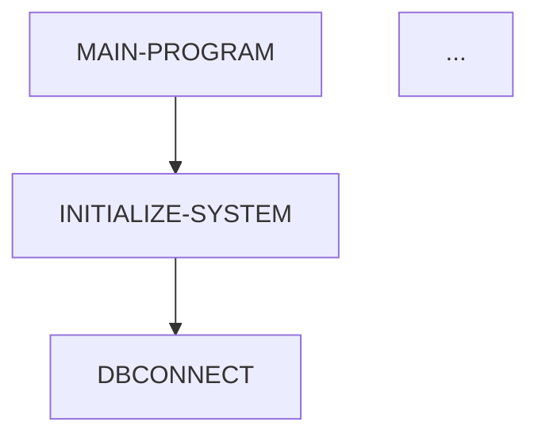

# COBOL Documentation Agent

A BMAD-METHOD inspired LangGraph agent that generates **consistent, comprehensive documentation** for COBOL codebases using metadata from SuperBol LSP, GnuCOBOL Analyzer, and Universal-Ctags.

## Key Features

- **Template-Driven**: Uses YAML templates to ensure consistent documentation structure
- **Metadata-Based**: Leverages existing static analysis metadata (no source code parsing needed)
- **LLM-Powered**: Uses Claude/GPT to intelligently interpret and explain code
- **Consistent Output**: Same template + same metadata = predictable, uniform documentation
- **Comprehensive**: Includes CFG, DFG, business logic, inter-program communication
- **Automated**: Batch process entire COBOL projects

## Architecture

```
┌─────────────────────────────────────────────────────────┐
│                   LangGraph Workflow                     │
├─────────────────────────────────────────────────────────┤
│                                                          │
│  1. Load Metadata ──> 2. Load Template                  │
│         │                     │                          │
│         └─────────┬───────────┘                          │
│                   ▼                                      │
│         3. Extract Structure                             │
│                   │                                      │
│                   ▼                                      │
│         ┌─────────────────┐                              │
│         │ 4. Process      │◄──── Loop for each           │
│         │    Section      │      section                 │
│         └─────────────────┘                              │
│                   │                                      │
│                   ▼                                      │
│         5. Assemble Document                             │
│                   │                                      │
│                   ▼                                      │
│         6. Save Document                                 │
│                                                          │
└─────────────────────────────────────────────────────────┘

Each section uses:
- Template instruction (what to do)
- Template format (how to format)
- Relevant metadata (source of truth)
- LLM (intelligent interpretation)

Result: Consistent, accurate documentation
```

## Installation

### Prerequisites

```bash
# Python 3.10+
python --version

# Install dependencies
pip install langgraph langchain-anthropic langchain-core pyyaml
```

### Setup

```bash
# 1. Clone or download the agent files
cd /home/santosh/cobol-work

# 2. Set up your LLM API key (Anthropic Claude)
export ANTHROPIC_API_KEY="your-api-key-here"

# Alternative: Use OpenAI
# pip install langchain-openai
# export OPENAI_API_KEY="your-api-key-here"
# Update cobol_doc_agent.py to use ChatOpenAI instead

# 3. Verify metadata exists
ls -la ./output/superbol/
ls -la ./output/gnucobol/
ls -la ./output/ctags/

# 4. Create output directory
mkdir -p docs
```

## Usage

### Basic Usage

```bash
# Generate documentation for a single program
python cobol_doc_agent.py MAINPROG
```

This will:
1. Load metadata from `./output/`
2. Use template from `./cobol-doc-template.yaml`
3. Generate documentation to `./docs/MAINPROG-documentation.md`

### Batch Processing

```bash
# Create batch script
cat > generate_all_docs.sh << 'EOF'
#!/bin/bash
PROGRAMS=(
    "MAINPROG"
    "ACCTOPER"
    "CUSTMGMT"
    "TRANPROC"
    "VALIDATE"
    "DBCONNECT"
    "DBCLOSE"
    "DBINSERT"
    "DBSELECT"
    "DBUPDATE"
    "DBDELETE"
    "LOGGER"
    "AUDITLOG"
    "ERRHANDL"
    "NOTIFIER"
    "REPTGEN"
)

for prog in "${PROGRAMS[@]}"; do
    echo "Generating documentation for $prog..."
    python cobol_doc_agent.py "$prog"
    echo "---"
done

echo "All documentation generated!"
EOF

chmod +x generate_all_docs.sh
./generate_all_docs.sh
```

### Custom Configuration

```python
from cobol_doc_agent import generate_documentation

# Custom paths
output_path = generate_documentation(
    program_name="MAINPROG",
    metadata_dir="./custom-output",
    template_path="./custom-template.yaml",
    output_dir="./custom-docs"
)

print(f"Generated: {output_path}")
```

## Template Customization

The template (`cobol-doc-template.yaml`) controls:
- Document structure
- Section order
- Content format
- Mermaid diagram types
- Level of detail

### Modifying the Template

**Example: Add a new section**

```yaml
sections:
  # ... existing sections ...

  - id: performance-analysis
    title: Performance Considerations
    instruction: |
      Analyze the code for performance characteristics:
      1. Identify loops (PERFORM UNTIL)
      2. Count database operations
      3. Identify potential bottlenecks
      4. Suggest optimizations
    template: |
      ### Performance Metrics

      **Database Operations**: {{db_op_count}}
      **Loop Complexity**: {{loop_analysis}}

      **Potential Bottlenecks**:
      {{bottleneck_list}}

      **Optimization Suggestions**:
      {{optimization_suggestions}}
```

**Example: Customize Mermaid diagram style**

```yaml
- id: cfg-diagram
  title: Control Flow Diagram
  type: mermaid
  mermaid_type: graph
  instruction: |
    Generate flowchart with custom styling:
    - Use LR (left-right) layout
    - Color-code by operation type:
      * Blue: Initialization
      * Green: Business logic
      * Orange: Database operations
      * Red: Error handling
    - Use rounded boxes for decision points
```

## How Consistency is Achieved

### 1. **Template Structure**
Every document follows the same section order and format defined in YAML.

### 2. **Deterministic Metadata**
Uses only structured metadata (JSON) - no freeform source code interpretation.

### 3. **Low Temperature LLM**
LLM temperature set to 0.1 for minimal variation in output.

### 4. **Explicit Instructions**
Each section has detailed instructions on what to include and how to format.

### 5. **Validation**
System prompt explicitly instructs LLM to:
- Follow template exactly
- Use only provided metadata
- Maintain consistent terminology
- Generate valid syntax

### Example Consistency Test

```bash
# Generate documentation twice
python cobol_doc_agent.py MAINPROG
mv docs/MAINPROG-documentation.md docs/MAINPROG-v1.md

python cobol_doc_agent.py MAINPROG
mv docs/MAINPROG-documentation.md docs/MAINPROG-v2.md

# Compare (should be nearly identical)
diff docs/MAINPROG-v1.md docs/MAINPROG-v2.md
```

Expected: Minimal differences (only timestamps and minor phrasing).

## Advanced Usage

### Custom Metadata Extractors

Add support for additional metadata sources:

```python
# In cobol_doc_agent.py, add new loader

def load_custom_metadata_node(state: AgentState) -> AgentState:
    """Load custom analysis metadata"""
    program_name = state["program_name"]
    custom_path = state["metadata_dir"] / "custom" / f"{program_name}.json"

    with open(custom_path, 'r') as f:
        state["custom_metadata"] = json.load(f)

    return state

# Add to workflow
workflow.add_node("load_custom", load_custom_metadata_node)
workflow.add_edge("load_template", "load_custom")
workflow.add_edge("load_custom", "extract_structure")
```

### Section-Specific LLM Models

Use different models for different sections:

```python
def generate_section_content(...):
    # Use faster/cheaper model for simple sections
    if section_id in ["document-header", "code-references"]:
        llm = ChatAnthropic(model="claude-3-haiku-20240307")

    # Use powerful model for complex analysis
    elif section_id in ["business-logic", "data-flow-analysis"]:
        llm = ChatAnthropic(model="claude-3-5-sonnet-20241022")

    # Default model
    else:
        llm = ChatAnthropic(model="claude-3-5-sonnet-20241022")
```

### Parallel Processing

Process multiple programs in parallel:

```python
from concurrent.futures import ProcessPoolExecutor
from cobol_doc_agent import generate_documentation

programs = ["MAINPROG", "ACCTOPER", "CUSTMGMT", "TRANPROC"]

with ProcessPoolExecutor(max_workers=4) as executor:
    futures = [
        executor.submit(generate_documentation, prog)
        for prog in programs
    ]

    results = [f.result() for f in futures]

print(f"Generated {len(results)} documents")
```

## Troubleshooting

### Missing Metadata Files

**Error**: `FileNotFoundError: superbol-MAINPROG-doc-symbols.json`

**Solution**: Ensure metadata was generated for this program
```bash
# Check what programs have metadata
ls output/superbol/superbol-*-doc-symbols.json | sed 's/.*superbol-//;s/-doc-symbols.json//'

# If missing, regenerate metadata for that program
```

### LLM API Errors

**Error**: `AuthenticationError: Invalid API key`

**Solution**: Set correct API key
```bash
export ANTHROPIC_API_KEY="sk-ant-..."
echo $ANTHROPIC_API_KEY  # Verify
```

### Inconsistent Output

**Issue**: Generated docs vary between runs

**Solution**: Check these factors:
1. Temperature setting (should be ≤ 0.1)
2. Template instructions are specific
3. Metadata hasn't changed
4. LLM model version is pinned

### Empty Sections

**Issue**: Some sections show "Information not available"

**Cause**: Metadata doesn't contain required information

**Solutions**:
- Update template instruction to work with available data
- Generate additional metadata
- Make section conditional: `condition: Has required metadata`

## Best Practices

### 1. Version Control Templates

```bash
git add cobol-doc-template.yaml
git commit -m "feat: add performance analysis section"
```

Track template changes so documentation evolution is traceable.

### 2. Metadata Freshness

```bash
# Add timestamp check
if [ $(find output/ -mtime +7 | wc -l) -gt 0 ]; then
    echo "Warning: Metadata is older than 7 days"
    echo "Consider regenerating metadata"
fi
```

### 3. Document Review Workflow

```bash
# 1. Generate docs
python cobol_doc_agent.py MAINPROG

# 2. Review with human expert
# 3. Capture feedback

# 4. Update template based on feedback
# 5. Regenerate

# 6. Compare changes
git diff docs/MAINPROG-documentation.md
```

### 4. Iterative Template Refinement

```
Initial Template → Generate Docs → Expert Review →
    Identify Issues → Update Template → Regenerate → Validate
```

### 5. Section-Specific Testing

Test individual sections during development:

```python
# Test just control-flow section
def test_section():
    state = {...}  # Mock state with test data
    content = process_section_node(state)
    print(content["generated_content"]["control-flow-analysis"])

test_section()
```

## Performance Optimization

### 1. Cache LLM Responses

```python
from functools import lru_cache
import hashlib

@lru_cache(maxsize=100)
def generate_section_content_cached(
    section_id: str,
    metadata_hash: str,  # Hash of metadata
    ...
):
    # Same implementation
    pass
```

### 2. Reduce Metadata Size

Only load relevant metadata per section:

```python
def build_section_context_optimized(state, section):
    # Instead of loading full CFG
    if section_id == "cfg-diagram":
        return {
            "nodes": state["superbol_cfg"]["nodes"][:50],  # Limit
            "edges": state["superbol_cfg"]["edges"][:100]
        }
```

### 3. Batch LLM Calls

Process multiple simple sections in one LLM call:

```python
# Combine related simple sections
if all(section_is_simple(s) for s in next_3_sections):
    combined_content = llm.invoke([
        SystemMessage("Generate these 3 sections..."),
        HumanMessage(combined_context)
    ])
```

## Output Examples

### Generated Document Structure

```markdown
# MAINPROG - Code Documentation

*Generated: 2025-10-15 14:30:00*

---

## Executive Summary

This program serves as the main entry point for the banking
application system...

**Key Responsibilities:**
- System initialization and database connection
- User menu display and input handling
- Routing to specialized operation handlers
...

## Program Structure

### COBOL Division Structure

| Division | Section/Element | Line Number | Purpose |
|----------|----------------|-------------|---------|
| IDENTIFICATION | PROGRAM-ID | 2 | Program identifier |
...

## Control Flow Analysis

### Control Flow Diagram



### Paragraph-Level Details

#### MAIN-PROGRAM (Line 21)

**Type**: paragraph

**Purpose**: Main program entry point that orchestrates...

**Control Flow**:
- Performs: INITIALIZE-SYSTEM, DISPLAY-MAIN-MENU...
- Calls External Programs: None
- Called By: Entry point

...
```

## Contributing

Improvements to the template or agent are welcome!

Areas for contribution:
- Additional diagram types (class diagrams, entity-relationship)
- Support for more metadata sources (SonarQube, custom analyzers)
- Enhanced business logic inference algorithms
- Template presets for different documentation styles
- Multi-language support (documentation in multiple languages)

## License

MIT License - feel free to use and modify for your projects.

## References

- **BMAD-METHOD**: https://github.com/bmad-code-org/BMAD-METHOD
- **LangGraph**: https://github.com/langchain-ai/langgraph
- **SuperBol LSP**: https://get-superbol.com/
- **GnuCOBOL**: https://gnucobol.sourceforge.io/
- **Universal-Ctags**: https://ctags.io/
