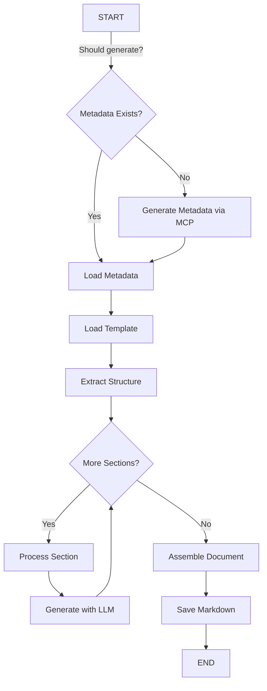

# COBOL Documentation Agent

> AI-powered documentation generator for legacy COBOL codebases using LangGraph, MCP servers, and LLMs

[](https://www.python.org/downloads/)
[](https://opensource.org/licenses/MIT)

---

## 📋 Table of Contents

- [Overview](#overview)
- [Key Features](#key-features)
- [Architecture](#architecture)
- [Quick Start](#quick-start)
- [Configuration](#configuration)
- [Usage Examples](#usage-examples)
- [Documentation Output](#documentation-output)
- [Advanced Features](#advanced-features)
- [Troubleshooting](#troubleshooting)
- [Development](#development)

---

## Overview

The COBOL Documentation Agent is an intelligent documentation generator that transforms legacy COBOL codebases into comprehensive, maintainable Markdown documentation. It uses **Model Context Protocol (MCP)** servers to extract structured metadata and **LangGraph workflows** to orchestrate multi-pass LLM-based documentation generation.

### What Makes It Special?

- **🎯 Template-Driven**: YAML templates ensure consistent structure across all documents
- **🔄 Three-Pass Generation**: Overview → Logic & Flow → Detailed Code with optimized token usage
- **📊 Rich Metadata**: Integrates CTags, SuperBOL LSP, and GnuCOBOL analysis
- **💾 Smart Caching**: SHA256 checksums prevent unnecessary regeneration
- **📈 TOON Integration**: 22% token savings enabling 50% more context in documentation
- **🔍 LLM Tracing**: Complete observability of all LLM calls with token usage and coverage metrics
- **⚡ Chunked Processing**: Handles large files (40K+ lines) by intelligent source code chunking

---

## Key Features

### Core Capabilities

✅ **Multi-Pass Generation**
- Pass 1: Executive Summary, Program Structure, Metadata
- Pass 2: Control Flow, Data Flow, Business Logic (TOON-enhanced)
- Pass 3: Detailed Code Explanation with intelligent chunking

✅ **Metadata Integration**
- **SuperBOL LSP**: Symbols, CFG, procedure/data divisions
- **GnuCOBOL Analyzer**: Program calls, paragraphs, sections
- **Universal CTags**: Comprehensive code outline

✅ **Smart Filtering**
- Automatic token budget management
- Pass-specific metadata filtering (99% reduction for Pass 1, conservative for Pass 2)
- TOON format for 22% token savings on large metadata structures

✅ **Source Code Management**
- Intelligent chunking for files >25K lines
- Paragraph boundary detection
- Overlap handling for context continuity
- Sequence number preservation

✅ **LLM Observability**
- JSON/JSONL trace logs for all LLM calls
- Token usage tracking (input/output/total)
- Coverage calculation for code explanation sections
- Per-section breakdown with timing

✅ **Checksum-Based Intelligence**
- SHA256 hashing of source files and metadata
- Automatic regeneration only when needed
- Corruption detection for metadata files
- 10x faster on unchanged files

### Advanced Features

🎨 **Mermaid Diagram Generation**
- Control flow diagrams
- Data flow diagrams
- Call hierarchies
- Sequence diagrams

🔧 **Multiple LLM Providers**
- OpenAI (GPT-4o, GPT-4-turbo)
- Anthropic (Claude 3.5 Sonnet)
- Google (Gemini)
- Azure OpenAI
- Ollama (local models)

📦 **Batch Processing**
- Process entire directories recursively
- Support for multiple file extensions (.cob, .cbl, .c74, .COBOL, etc.)
- Parallel metadata generation via MCP servers

---

## Architecture

### System Components

```
┌─────────────────────────────────────────────────────────────────┐
│                     COBOL Documentation Agent                    │
│                                                                   │
│  ┌────────────────┐  ┌──────────────┐  ┌────────────────────┐  │
│  │  MCP Metadata  │  │  LangGraph   │  │  Template Engine   │  │
│  │   Generator    │→│   Workflow   │→│   (YAML-based)     │  │
│  └────────────────┘  └──────────────┘  └────────────────────┘  │
│          ↓                   ↓                     ↓             │
│  ┌────────────────┐  ┌──────────────┐  ┌────────────────────┐  │
│  │  Checksum Mgr  │  │  LLM Tracer  │  │  Source Chunker    │  │
│  └────────────────┘  └──────────────┘  └────────────────────┘  │
└─────────────────────────────────────────────────────────────────┘
                                ↓
                    ┌───────────────────────┐
                    │   LLM Provider        │
                    │  (OpenAI/Anthropic/   │
                    │   Google/Azure/       │
                    │   Ollama)             │
                    └───────────────────────┘
```

### LangGraph Workflow



### Three-Pass Strategy

| Pass | Sections | Metadata | Token Budget |
|------|----------|----------|--------------|
| **Pass 1** | Executive Summary, Program Structure, Appendix | Summary only (99% reduction) | ~50K tokens |
| **Pass 2** | Control Flow, Data Flow, Business Logic, IPC, Code Refs | Full structures + TOON (22% savings) | ~500K tokens |
| **Pass 3** | Detailed Code Explanation | Minimal (program name only) | ~800K tokens |

---

## Quick Start

### Prerequisites

- Python 3.10+
- Docker (for MCP servers)
- OpenAI API key (or other LLM provider)
- COBOL source files

### Installation

```bash
# 1. Clone the repository
cd /path/to/cobol-work/agent

# 2. Create virtual environment
python3 -m venv .venv
source .venv/bin/activate  # On Windows: .venv\Scripts\activate

# 3. Install dependencies
pip install -r requirements.txt

# 4. Set up environment variables
export OPENAI_API_KEY="sk-..."  # Or your LLM provider key
```

### First Run

```bash
# 1. Copy example configuration
cp config.example.yaml config.yaml

# 2. Edit configuration (set source files path, output paths, etc.)
nano config.yaml

# 3. Run the agent
python cobol_doc_agent.py --config config.yaml

# 4. View generated documentation
cat ../docs/PROGRAM-NAME-documentation.md
```

---

## Configuration

### Configuration File Structure

The agent uses YAML configuration files. See `config.example.yaml` for a fully documented example.

#### Key Sections

```yaml
# Source files
source:
  mode: single              # or 'batch' for multiple files
  source_files: path/to/file.cbl
  program_name: MYPROG

# Output directories
output:
  metadata_dir: ../metadata
  docs_path: ../docs
  create_dirs: true

# Checksum validation
validate_checksums:
  source_checksum_file_path: ./source-checksum.yaml
  metadata_checksum_file_path: ./metadata-checksum.yaml

# MCP servers for metadata generation
servers:
  ctags:
    enabled: true
    docker_image: ctags-mcp:latest
  gnuCobol:
    enabled: true
    docker_image: gnucobol-mcp:latest
  superbol-lsp:
    enabled: true
    docker_image: superbol-lsp-mcp:latest

# Metadata generation
metadata:
  generate: false  # Set to true to generate metadata
  skip_existing: true

# LLM configuration
llm:
  provider: openai
  model: gpt-4o
  api_key: ${OPENAI_API_KEY}
  temperature: 0.2

# Source code extraction for detailed explanation
source_extraction:
  enabled: true
  compress: false

# Logging
logging:
  level: info
  verbose: true
```

### Multiple LLM Providers

#### OpenAI
```yaml
llm:
  provider: openai
  model: gpt-4o
  api_key: ${OPENAI_API_KEY}
  temperature: 0.2
```

#### Anthropic Claude
```yaml
llm:
  provider: anthropic
  model: claude-3-5-sonnet-20241022
  api_key: ${ANTHROPIC_API_KEY}
  temperature: 0.2
```

#### Google Gemini
```yaml
llm:
  provider: google
  model: gemini-1.5-pro
  api_key: ${GOOGLE_API_KEY}
  temperature: 0.2
```

See `CONFIG_GUIDE.md` for complete configuration documentation.

---

## Usage Examples

### Example 1: Single Program (Existing Metadata)

```bash
# Generate documentation using pre-existing metadata
python cobol_doc_agent.py MAINPROG \
  --workspace ../cobol-source \
  --output-dir ../metadata \
  --docs-path ../docs
```

### Example 2: Single Program (Generate Metadata)

```bash
# Generate metadata AND documentation in one run
python cobol_doc_agent.py MAINPROG \
  --workspace ../cobol-source \
  --output-dir ../metadata \
  --docs-path ../docs \
  --generate-metadata
```

### Example 3: Batch Processing

```bash
# Process all COBOL files in a directory
python cobol_doc_agent.py \
  --source-files ../cobol-source \
  --output-dir ../metadata \
  --docs-path ../docs \
  --generate-metadata
```

### Example 4: Using Config File (Recommended)

```bash
# All settings in config.yaml
python cobol_doc_agent.py --config config.yaml
```

### Example 5: Python API

```python
from cobol_doc_agent import generate_documentation

output_path = generate_documentation(
    program_name="MAINPROG",
    workspace_path="../cobol-source",
    metadata_dir="../metadata",
    template_path="./cobol-doc-template.yaml",
    output_dir="../docs",
    generate_metadata=False,
    llm_config={
        "provider": "openai",
        "model": "gpt-4o",
        "api_key": "sk-...",
        "temperature": 0.2
    }
)
print(f"Documentation generated: {output_path}")
```

---

## Documentation Output

### Generated Documentation Structure

Each program generates a comprehensive Markdown document with:

#### 1. Executive Summary
- Program overview
- Key responsibilities
- Input/output files
- External programs called

#### 2. Program Structure
- Division breakdown (IDENTIFICATION, ENVIRONMENT, DATA, PROCEDURE)
- Section organization
- Copybook dependencies
- Data definitions summary

#### 3. Control Flow Analysis
- **Mermaid flowchart** of program execution
- Entry points and termination paths
- Conditional logic branches
- Loop structures

#### 4. Data Flow Analysis
- Input/output file operations
- Data transformation pipeline
- Working storage usage
- File organization (VSAM, sequential, indexed)

#### 5. Inter-Program Communication
- CALL statements with parameters
- Program call hierarchy
- Call frequency heatmap
- External dependencies

#### 6. Business Logic Explanation
- Business operations catalog
- Processing rules
- Calculation logic
- Decision points

#### 7. Detailed Code Explanation (Chunked)
- Complete source code with line numbers
- Paragraph-by-paragraph analysis
- Variable tracking
- Business rule identification

#### 8. Error Handling Strategy
- Error detection mechanisms
- Error reporting procedures
- Recovery procedures
- Validation rules

#### 9. Technical Details
- Performance characteristics
- Complexity metrics
- Code quality indicators
- Modernization opportunities

#### 10. Code References
- Cross-reference table
- Called paragraphs index
- Data item usage
- File operation index

#### 11. Appendix - Metadata Summary
- Symbols count
- CFG statistics
- Analysis tool versions
- Generation timestamp

### Sample Output

```markdown
# TDAS-MINDISTCALC Documentation

## Executive Summary

TDAS-MINDISTCALC is a COBOL program responsible for calculating minimum distribution
amounts for retirement accounts based on IRS regulations...

### Key Responsibilities
- Calculate Required Minimum Distribution (RMD)
- Apply IRS life expectancy tables
- Generate distribution notices
...

## Control Flow Analysis

### Program Flow Diagram

\```mermaid
graph TD
    A[START] --> B[1000-INIT-PROCESS]
    B --> C[2000-MAIN-PROCESS]
    C --> D{More Records?}
    D -->|Yes| E[3000-CALC-RMD]
    ...
\```
...
```

---

## Advanced Features

### 1. TOON Integration (22% Token Savings)

The agent uses **TOON (Token-Oriented Object Notation)** format for metadata in Pass 2, achieving 22% token savings:

- **CTags**: 37.4% savings (853K → 534K tokens)
- **SuperBOL**: 23.1% savings (1.78M → 1.37M tokens)
- **GnuCOBOL**: Kept as JSON (0% benefit)

This enables sending **50% more paragraphs** (100→150) and **30% more CFG nodes** (500→650) to the LLM.

### 2. Intelligent Source Chunking

For large files (>25K lines), the agent automatically:
- Splits code at paragraph boundaries
- Maintains 50-line overlap for context
- Preserves sequence numbers
- Tracks coverage metrics

**Configuration**:
```yaml
source_extraction:
  enabled: true
  chunk_size: 500        # lines per chunk
  overlap_lines: 50      # overlap between chunks
  compress: false        # Remove comments/blanks
```

### 3. LLM Call Tracing

Every LLM call is traced and logged:

```
llm_trace_PROGRAM.jsonl       # Append-only log (for streaming)
llm_trace_PROGRAM.json        # Pretty JSON (for inspection)
llm_trace_PROGRAM_report.txt  # Human-readable summary
```

**Report includes**:
- Total LLM calls and duration
- Token usage (input/output/total)
- Cost estimates
- Code explanation coverage (%)
- Per-section breakdown

### 4. Checksum-Based Intelligence

SHA256 checksums track changes to:
- Source COBOL files
- Generated metadata files

**Benefits**:
- Skip metadata generation if source unchanged
- Detect corrupted/incomplete metadata
- Audit trail of all changes
- 10x faster regeneration

**Files**:
- `source-checksum.yaml` - Source file hashes
- `metadata-checksum.yaml` - Metadata file hashes

---

## Troubleshooting

### Common Issues

#### 1. ModuleNotFoundError

```bash
# Solution: Install dependencies
pip install -r requirements.txt
```

#### 2. OpenAI Authentication Error

```bash
# Solution: Set API key
export OPENAI_API_KEY="sk-..."
echo $OPENAI_API_KEY  # Verify it's set
```

#### 3. Metadata Not Found

```bash
# Solution: Generate metadata first
python cobol_doc_agent.py PROGRAM --generate-metadata --workspace ../source
```

#### 4. MCP Server Connection Failed

```bash
# Solution: Check Docker containers are running
docker ps | grep mcp

# Start MCP servers
docker-compose up -d
```

#### 5. Output Varies Between Runs

```yaml
# Solution: Lower temperature in config
llm:
  temperature: 0.1  # Lower = more deterministic
```

#### 6. Token Limit Exceeded

```yaml
# Solution: Enable more aggressive filtering or chunking
source_extraction:
  chunk_size: 300  # Smaller chunks
  compress: true   # Remove non-executable lines
```

### Debugging

Enable verbose logging:

```yaml
logging:
  level: debug
  verbose: true
```

Check LLM trace files:

```bash
# View token usage
cat llm_trace_PROGRAM_report.txt

# Inspect full requests/responses
cat llm_trace_PROGRAM.json
```

---

## Development

### Project Structure

```
agent/
├── cobol_doc_agent.py              # Main LangGraph workflow
├── mcp_metadata_generator.py       # MCP server integration
├── checksum_manager.py             # SHA256 checksum management
├── source_chunker.py               # Large file chunking logic
├── source_integration.py           # Source code integration
├── llm_tracer.py                   # LLM observability
├── chunk_validation.py             # Chunk validation utilities
├── metadata_toon_converter.py      # TOON format converter
├── config_loader.py                # YAML config loader
├── cobol-doc-template.yaml         # Documentation template
├── config.example.yaml             # Full config example
├── requirements.txt                # Python dependencies
├── TESTING_GUIDE.md                # Testing instructions
├── CONFIG_GUIDE.md                 # Configuration reference
└── docs/
    └── toon/                       # TOON integration docs
```

### Core Modules

| Module | Purpose |
|--------|---------|
| `cobol_doc_agent.py` | LangGraph workflow orchestration |
| `mcp_metadata_generator.py` | MCP server communication |
| `checksum_manager.py` | Change detection and validation |
| `source_chunker.py` | Large file handling |
| `llm_tracer.py` | LLM observability and metrics |
| `metadata_toon_converter.py` | Token-efficient metadata encoding |

### Running Tests

```bash
# Activate virtual environment
source .venv/bin/activate

# Run test suite (see TESTING_GUIDE.md)
python -m pytest tests/

# Verify setup
./test_setup.sh
```

### Extending the Agent

#### Adding a New Documentation Section

1. Edit `cobol-doc-template.yaml`:
```yaml
sections:
  - id: my-new-section
    title: My New Section
    instruction: |
      Analyze the metadata and generate...
    template: |
      ### {{section_title}}
      ...
```

2. No code changes needed! The agent automatically processes new sections.

#### Adding a New LLM Provider

Edit `cobol_doc_agent.py`, function `create_llm()`:

```python
elif provider == "my_provider":
    from langchain_my_provider import ChatMyProvider
    return ChatMyProvider(
        model=llm_config.get('model'),
        api_key=llm_config.get('api_key'),
        ...
    )
```

---

## Performance & Costs

### Typical Processing Time

| File Size | Lines | Metadata Gen | Doc Gen | Total |
|-----------|-------|--------------|---------|-------|
| Small | < 5K | 30s | 2 min | 2.5 min |
| Medium | 5K-25K | 60s | 5 min | 6 min |
| Large | 25K-50K | 120s | 15 min | 17 min |
| Very Large | > 50K | 180s | 30 min | 33 min |

### Token Usage (Typical)

| Pass | Input Tokens | Output Tokens | Total |
|------|--------------|---------------|-------|
| Pass 1 | ~40K | ~5K | ~45K |
| Pass 2 | ~400K | ~20K | ~420K |
| Pass 3 | ~600K | ~150K | ~750K |
| **Total** | **~1.04M** | **~175K** | **~1.21M** |

### Cost Estimate (GPT-4o)

- Input: $5.00 per 1M tokens
- Output: $15.00 per 1M tokens

**Per Program**: ~$5.20-7.80
**Per 10 Programs**: ~$52-78

*(Costs as of November 2024, check OpenAI pricing for current rates)*

---

## Features Roadmap

### Current (v1.0)

✅ Three-pass generation with intelligent filtering
✅ TOON integration for 22% token savings
✅ Intelligent source chunking for large files
✅ LLM call tracing with coverage metrics
✅ Multi-provider LLM support
✅ Checksum-based change detection
✅ Batch processing

### Planned (v1.1)

🔲 Incremental documentation updates (only changed sections)
🔲 Parallel section generation (faster processing)
🔲 Custom diagram templates
🔲 Export to PDF/HTML
🔲 Interactive documentation viewer

---

## Contributing

Contributions welcome! Please:

1. Fork the repository
2. Create a feature branch
3. Make your changes
4. Add tests if applicable
5. Submit a pull request

---

## License

MIT License - See LICENSE file for details

---

## Support

- **Documentation**: See `TESTING_GUIDE.md` and `CONFIG_GUIDE.md`
- **Issues**: Report bugs or request features via GitHub Issues
- **Questions**: Check existing documentation first, then open a discussion

---

## Acknowledgments

- Built with [LangGraph](https://github.com/langchain-ai/langgraph) for workflow orchestration
- Uses [Model Context Protocol (MCP)](https://modelcontextprotocol.io) for metadata extraction
- Inspired by the [BMAD-METHOD](https://github.com/mavidian/bmad) for template-driven generation
- TOON format by [@toon-format](https://github.com/toon-format)

---

**Happy Documenting! 📚🤖**
