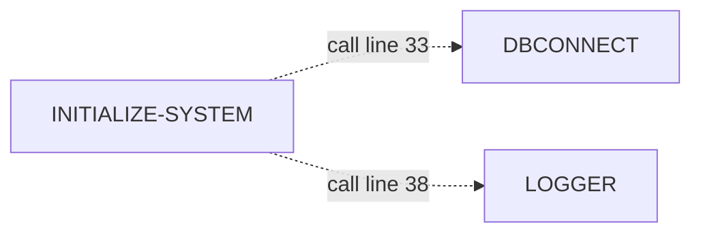
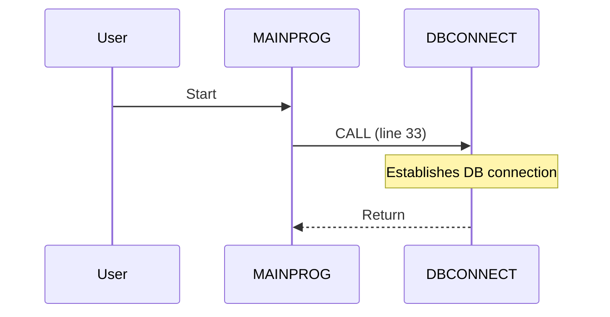

# Testing Guide - Enhanced COBOL Documentation Agent

## Prerequisites

1. **OpenAI API Key**: You need a valid OpenAI API key
2. **Virtual Environment**: Already set up at `/home/santosh/cobol-work/agent/.venv`
3. **Dependencies**: Already installed (langgraph, langchain-openai, pyyaml, etc.)

---

## Quick Test - Single Program

### Step 1: Set API Key
```bash
cd /home/santosh/cobol-work/agent
export OPENAI_API_KEY='your-api-key-here'
```

### Step 2: Activate Virtual Environment
```bash
source .venv/bin/activate
```

### Step 3: Generate Documentation for MAINPROG
```bash
python3 cobol_doc_agent.py MAINPROG
```

### Expected Output
```
======================================================================
COBOL Documentation Generator
Program: MAINPROG
======================================================================

Loading metadata for program: MAINPROG
✓ Successfully loaded all metadata for MAINPROG
Loading template from: cobol-doc-template.yaml
✓ Template loaded successfully
Template has 11 main sections to process

Processing section: document-header - {{program_name}} Documentation
  ✓ Generated 456 characters for document-header

Processing section: executive-summary - Executive Summary
  ✓ Generated 1234 characters for executive-summary

Processing section: program-structure - Program Structure
  ✓ Generated 2345 characters for program-structure

Processing section: control-flow-analysis - Control Flow Analysis
  ✓ Generated 3456 characters for control-flow-analysis

Processing section: data-flow-analysis - Data Flow Analysis
  ✓ Generated 1567 characters for data-flow-analysis

Processing section: inter-program-communication - Inter-Program Communication
  ✓ Generated 4567 characters for inter-program-communication

Processing section: business-logic - Business Logic Explanation
  ✓ Generated 3890 characters for business-logic

Processing section: error-handling - Error Handling Strategy
  ✓ Generated 890 characters for error-handling

Processing section: technical-details - Technical Details
  ✓ Generated 1234 characters for technical-details

Processing section: code-references - Code References
  ✓ Generated 567 characters for code-references

Processing section: metadata-appendix - Appendix - Metadata Summary
  ✓ Generated 678 characters for metadata-appendix

Assembling final document...
✓ Document assembled: 21234 characters

✓ Documentation saved to: ../docs/MAINPROG-documentation.md

======================================================================
Documentation generation complete!
Output: ../docs/MAINPROG-documentation.md
======================================================================
```

### Step 4: Review Generated Documentation
```bash
# View the documentation
cat ../docs/MAINPROG-documentation.md

# Or open in a viewer
less ../docs/MAINPROG-documentation.md
```

---

## What to Look For in Generated Documentation

### 1. Enhanced Control Flow Section
**Look for:**
- Combined Mermaid diagram with both `-->` (PERFORM) and `-.->` (CALL) arrows
- Line numbers on CALL edges (e.g., `"call line 33"`)
- Different styling for external programs (cyan background)
- External Call Context subsection with detailed descriptions
- Paragraph Complexity Analysis table

**Example:**


### 2. Call Frequency Heatmap
**Look for:**
- Table with columns: Program Called | Call Count | Called From Paragraphs | Category
- Categories with icons: 🔥 Critical, ⚠️ High, ℹ️ Medium
- Sorted by call count descending

**Example:**
```
| LOGGER | 5 | INITIALIZE-SYSTEM, HANDLE-CUSTOMER-OPS, ... | 🔥 Critical |
| ERRHANDL | 3 | HANDLE-ACCOUNT-OPS, HANDLE-TRANSACTIONS, ... | ⚠️ High |
```

### 3. Program Call Hierarchy Diagram
**Look for:**
- Central node for MAINPROG (styled prominently)
- Frequency annotations on edges (e.g., `"5x"`, `"3x"`)
- Color coding by frequency
- Line numbers for single calls

### 4. System-Wide Dependencies Diagram
**Look for:**
- Layered architecture view
- Entry Layer / Business Logic / Data Access / Utility Services subgraphs
- Current program highlighted within appropriate layer

### 5. Execution Flow Sequence Diagram
**Look for:**
- Sequence diagram showing realistic execution flow
- PERFORM operations (solid arrows)
- CALL operations with line numbers (dashed arrows)
- Loops, conditionals, error paths
- Notes explaining each interaction

**Example:**


### 6. Detailed Call Analysis
**Look for:**
- One subsection per external program called
- Local call count with paragraph names and line numbers
- System-wide call count (from gnucobol_analysis)
- Classification and purpose explanation

---

## Verification Checklist

After generating documentation, verify:

- [ ] Document is saved to `../docs/MAINPROG-documentation.md`
- [ ] File size is significantly larger than previous version (before was ~3KB, should now be 15-30KB)
- [ ] Contains 11 main sections
- [ ] Control Flow section has Mermaid diagram with both PERFORM and CALL
- [ ] External Call Context section lists calls by paragraph with line numbers
- [ ] Call Frequency Heatmap table exists with categories
- [ ] Program Call Hierarchy diagram exists
- [ ] System-Wide Dependencies diagram exists with layers
- [ ] Execution Flow Sequence diagram exists
- [ ] Detailed Call Analysis has one section per external program
- [ ] All Mermaid diagrams use valid syntax (```mermaid ... ```)
- [ ] Line numbers appear throughout documentation

---

## Compare Before and After

### Before Enhancement (Old File)
```bash
# The old documentation is still in ../docs/MAINPROG-documentation.md
# It will be overwritten by the new generation
# To compare, first backup the old one:
cp ../docs/MAINPROG-documentation.md ../docs/MAINPROG-documentation-OLD.md
```

### After Enhancement (New File)
```bash
# Generate new documentation
python3 cobol_doc_agent.py MAINPROG

# Compare
diff ../docs/MAINPROG-documentation-OLD.md ../docs/MAINPROG-documentation.md
# Or use a side-by-side diff viewer
```

**Expected Differences:**
- New file is 5-10x larger
- Contains multiple new Mermaid diagrams
- Has tables for frequency analysis and complexity
- Includes detailed call analysis per program

---

## Batch Testing - All Programs

Once single program generation is verified:

### Option 1: Python Script (Recommended)
```bash
python3 generate_all_docs.py
```

**Features:**
- Shows progress for each program
- Tracks success/failed programs
- Displays summary at end
- Lists failed programs with errors
- Shows file sizes

**Expected Output:**
```
==========================================================================
COBOL Documentation Generator - Batch Mode
==========================================================================

Found 16 programs to document:
  - ACCTOPER
  - AUDITLOG
  - CUSTMGMT
  - DBCLOSE
  - DBCONNECT
  - ERRHANDL
  - LOGGER
  - MAINPROG
  - NOTIFIER
  - REPTGEN
  - TRANPROC
  - ... (and 5 more)

Generate documentation for all 16 programs? (y/n): y

==========================================================================
Starting batch generation...
==========================================================================

[1/16] Processing ACCTOPER...
  ✓ Success: ../docs/ACCTOPER-documentation.md

[2/16] Processing AUDITLOG...
  ✓ Success: ../docs/AUDITLOG-documentation.md

...

==========================================================================
Batch Generation Complete!
==========================================================================
Success: 16 programs
Failed:  0 programs

Documentation saved to: ../docs/
Total files: 16

Generated files:
  - ACCTOPER-documentation.md (24,567 bytes)
  - AUDITLOG-documentation.md (18,234 bytes)
  - CUSTMGMT-documentation.md (28,901 bytes)
  ...
```

### Option 2: Bash Script
```bash
./generate_all_docs.sh
```

**Features:**
- Simple progress tracking
- Success/failure counts
- Lists failed programs

---

## Troubleshooting

### Issue: "OPENAI_API_KEY not set"
**Solution:**
```bash
export OPENAI_API_KEY='your-api-key-here'
# Verify it's set
echo $OPENAI_API_KEY
```

### Issue: "ModuleNotFoundError: No module named 'langgraph'"
**Solution:**
```bash
source .venv/bin/activate
# Or reinstall dependencies
pip install -r requirements.txt
```

### Issue: "FileNotFoundError: metadata files not found"
**Solution:**
Verify metadata exists:
```bash
ls -la ../output/superbol/superbol-MAINPROG-doc-symbols.json
ls -la ../output/superbol/superbol-cfg/MAINPROG.json
ls -la ../output/gnucobol/gnucobol-batch-analyze-all.json
ls -la ../output/ctags/ctags-MAINPROG-outline.json
```

### Issue: Empty documentation or "Information not available"
**Cause:** Metadata files exist but are empty or malformed
**Solution:** Regenerate metadata using SuperBol, GnuCOBOL, and ctags

### Issue: "Rate limit exceeded" from OpenAI
**Solution:**
- Wait and retry (rate limits reset after a time window)
- Use smaller batches
- Consider upgrading OpenAI plan

---

## Performance Expectations

### Single Program
- **Time**: 30-60 seconds (depends on program complexity and API latency)
- **API Calls**: ~11 calls (one per section)
- **Output Size**: 15-30 KB markdown file

### Batch Generation (16 programs)
- **Time**: 10-20 minutes total
- **API Calls**: ~176 calls (11 per program × 16 programs)
- **Total Output**: 240-480 KB (16 files)

### Cost Estimate (OpenAI GPT-4o)
- **Input**: ~5,000 tokens per section (metadata + template)
- **Output**: ~1,000 tokens per section
- **Per Program**: ~66,000 input + 11,000 output tokens
- **16 Programs**: ~1,056,000 input + 176,000 output tokens
- **Approximate Cost**: $5-10 USD (varies by OpenAI pricing)

---

## Quality Assurance

After generation, randomly check 3-5 generated documentation files:

### Check 1: Mermaid Syntax Validity
```bash
# Ensure all Mermaid blocks are properly closed
grep -A 20 '```mermaid' ../docs/MAINPROG-documentation.md | grep '```$'
```

### Check 2: Line Number References
```bash
# Verify line numbers appear throughout
grep -i "line [0-9]" ../docs/MAINPROG-documentation.md | head -20
```

### Check 3: External Call Coverage
```bash
# Ensure all external programs are documented
grep -i "###.*LOGGER" ../docs/MAINPROG-documentation.md
grep -i "###.*ERRHANDL" ../docs/MAINPROG-documentation.md
grep -i "###.*DBCONNECT" ../docs/MAINPROG-documentation.md
```

### Check 4: Table Formatting
```bash
# Verify tables are properly formatted
grep "^|" ../docs/MAINPROG-documentation.md | head -10
```

---

## Next Steps After Successful Testing

1. **Review Quality**: Manually review 2-3 generated docs for accuracy
2. **Adjust Template**: If needed, refine instructions in `cobol-doc-template.yaml`
3. **Run Full Batch**: Generate docs for all 16 programs
4. **Version Control**: Commit generated docs to git
5. **Share with Team**: Distribute documentation for review
6. **Iterate**: Gather feedback and enhance template further

---

## Support

If you encounter issues:
1. Check this testing guide
2. Review `ENHANCEMENTS_SUMMARY.md` for implementation details
3. Review `BEFORE_AFTER_COMPARISON.md` for expected outputs
4. Check agent logs for error messages
5. Verify metadata files are valid JSON

---

*Last Updated: 2025-10-16*
