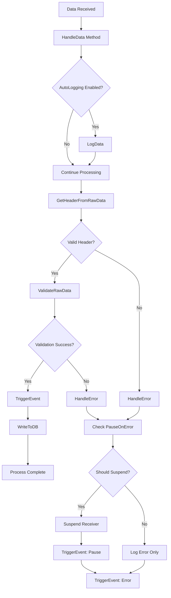
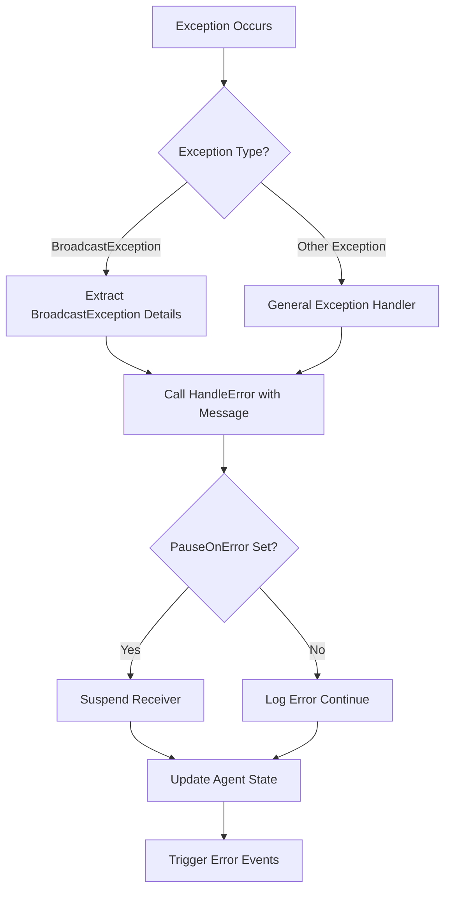

### Control Flow Analysis

The BroadcastService application implements a complex broadcast data handling system with multiple execution paths and error handling mechanisms. Due to context overflow issues in processing chunks 1 and 2, this analysis is based on the available metadata from chunk 3 (lines 3225-3810).

#### Main Execution Paths

**Data Reception and Processing Flow:**

#### Initialization Flow

Information not available in metadata for complete initialization flow. The available metadata covers only the final chunk (lines 3225-3810) which contains operational methods rather than initialization code.

#### Method Call Chains

**Primary Data Handling Chain (Lines 3236-3393):**

1. **HandleData** (entry point for incoming broadcast data)
   - Updates `lastReceivedData` timestamp (line 3240)
   - Converts data to string format (line 3244)
   - Optionally calls **LogData** if AutoLogging enabled (lines 3246-3249)
   - Calls `config.GetHeaderFromRawData` for header extraction (lines 3256-3260)
   - Calls `hdr.ValidateRawData` for validation (lines 3262-3279)
   - Calls **TriggerEvent** to notify listeners (line 3268)
   - Calls `hdr.WriteToDB` for persistence (line 3272)
   - Calls **HandleError** on validation failure (lines 3281-3286)
   - Uses external database utilities: `ng.utils.DatabaseUtil.GetSK` and `executeNonQuery` (lines 3318-3390)

**Error Handling Chain (Lines 3395-3409):**

2. **HandleError** (called when errors occur)
   - Stores error in `lastRawError` field (line 3398)
   - Calls **suspend** method (line 3399)
   - Calls **TriggerEvent** twice (pause and error events) (lines 3400-3401)
   - Calls `profile.ProfileStation.agent.agentData.setAttribute` (line 3403)
   - Calls `profile.OnInvalidBroadcastData` event (line 3404)

**Confirmation Processing Chains:**

3. **ConfirmationBroadcastProcessed** (lines 3411-3421)
   - Creates SequenceBroadcast instance (line 3413)
   - Sets broadcast attributes (lines 3414-3415)
   - Calls `setAttribute` on agent qualified data (line 3418)
   - Calls `profile.OnValidBroadcastProcessed` event (line 3419)

4. **BroadcastConfirmed** (lines 3423-3433)
   - Calls **IsEventImplemented** to check script availability (line 3424)
   - Conditionally calls `setAttribute` (line 3429)
   - Conditionally calls `profile.OnBroadcastConfirmed` event (line 3430)

#### Event Handlers and Callbacks

**Event Triggering Mechanism:**

The service uses an event-driven architecture with the following event patterns:

- **Valid Broadcast Processing**: `OnValidBroadcastProcessed` (line 3419)
- **Invalid Data Handling**: `OnInvalidBroadcastData` (line 3404)
- **Confirmation Events**: `OnBroadcastConfirmed` (line 3430)
- **State Change Events**: TriggerEvent for pause and error conditions (lines 3400-3401)

**Event Conditional Execution:**

Events may be conditionally executed based on:
- AutoLogging configuration (lines 3246-3249)
- PauseOnError settings (line 3396)
- Script implementation availability (line 3424)

#### Error Handling Paths

**Exception Handling in HandleData (Lines 3288-3310):**

**Error Handling Features:**

- **Validation Failures**: Handled by calling HandleError method (lines 3281-3286)
- **Unknown Headers**: Specific error path for unrecognized broadcast headers (lines 3312-3316)
- **Exception Recovery**: Graceful degradation with database insertion for suspended data (lines 3318-3390)
- **State Management**: Error messages stored in `lastRawError` field for diagnostics (line 3398)
- **Receiver Suspension**: Automatic suspension on critical errors based on configuration (line 3399)

#### Control Flow Characteristics

**Thread Safety Considerations:**

The HandleData method implements thread-safe operations:
- Thread-safe retrieval of header definitions (lines 3256-3260)
- Synchronized database operations using DatabaseUtil

**Conditional Processing Paths:**

- **Format Matching**: Main processing occurs only when formatter matches expected data format (line 3242)
- **Configuration-Driven**: Behavior controlled by AutoLogging, PauseOnError settings
- **Event-Driven**: Optional event execution based on script implementation checks

**Data Persistence Points:**

- Successful broadcasts: Written via `hdr.WriteToDB` (line 3272)
- Suspended/unprocessed data: Direct database insertion (lines 3318-3390)
- Error states: Stored in lastRawError field and agent attributes

---

**Note**: Complete control flow analysis is limited by the unavailability of chunks 1 and 2 (lines 1-3224) due to context overflow. The initialization flow, constructor logic, and early-stage processing paths are not documented in this analysis. This section covers the operational control flow for data handling, error management, and confirmation processing based on available metadata from chunk 3.