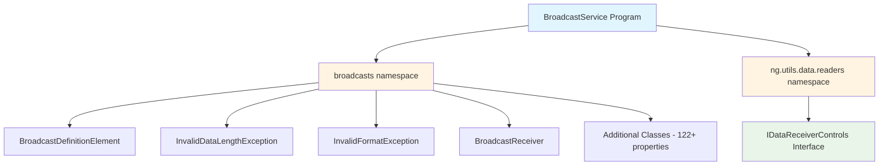

### Program Structure

The BroadcastService program is organized into two primary namespaces with multiple classes, interfaces, and their members. The following structure has been inferred from the available metadata.

#### Namespaces

The program is organized into two distinct namespaces:

1. **broadcasts** (line 3)
   - Primary namespace containing broadcast-related definitions and exception types
   - Houses core broadcast processing classes and data structures

2. **ng.utils.data.readers** (line 3801)
   - Utility namespace for data reading infrastructure
   - Contains interface definitions for data receiver controls

#### Interfaces

##### IDataReceiverControls (line 3803)

**Purpose:** Standardizes control operations for data receivers across different implementations.

**Location:** `ng.utils.data.readers` namespace

**Members:**
- `pause()` - Method for pausing data reader operations
- `stop()` - Method for stopping data reader operations
- `resume()` - Method for resuming data reader operations

**Design Pattern:** Interface Segregation Principle - provides a focused contract for receiver control operations

#### Classes and Their Members

Based on the metadata, the program contains several key classes organized by their functional responsibilities:

##### BroadcastDefinitionElement (broadcasts namespace)

**Purpose:** Represents a single element within a broadcast message definition, encapsulating validation rules, data extraction, and formatting logic.

**Properties:**
- `Required` (line 44) - Boolean flag indicating if the element is mandatory
- `RequiredCondition` (line 56) - Conditional logic determining when the element is required
- `ExtendedProperties` (line 68) - Collection of additional properties for extensibility
- `HeaderElement` (line 76) - Reference to the parent header element
- `ReceivedValue` (line 87) - The actual value received from broadcast data
- `Value` (line 99) - The processed/normalized value of the element
- `DataIndex` (line 111) - Position index for data extraction
- `Name` (line 127) - Identifier name for the element
- `Count` (line 155) - Occurrence count or expected number of elements

**Inferred Purpose:** This class implements a **Data Transfer Object (DTO)** pattern combined with validation logic, managing individual broadcast message components and their validation rules.

##### InvalidDataLengthException (broadcasts namespace)

**Purpose:** Custom exception type for handling data length validation failures in broadcast processing.

**Properties:**
- `ReceivedData` (line 226) - The actual data that failed validation
- `ExpectedFormat` (line 234) - The format specification that was expected
- `BroadcastDefinitionElement` (line 242) - Reference to the definition element that triggered the exception

**Inferred Purpose:** Implements the **Exception Handling** pattern with rich diagnostic information for data length mismatches.

##### InvalidFormatException (broadcasts namespace)

**Purpose:** Custom exception type for handling format validation failures in broadcast processing.

**Properties:**
- `ReceivedData` (line 278) - The actual data that failed format validation
- `ExpectedFormat` (line 286) - The format specification that was expected
- `BroadcastDefinitionElement` (line 294) - Reference to the definition element that triggered the exception

**Inferred Purpose:** Implements the **Exception Handling** pattern with contextual information for format validation failures.

##### BroadcastReceiver (inferred from methods in chunk 3)

**Purpose:** Core service class responsible for receiving, validating, and processing broadcast messages.

**Properties:**
- `AutoLogging` (line 3225) - Boolean property controlling automatic logging of broadcast data

**Methods:**
- `HandleData` (line 3236) - Core method processing incoming broadcast data with validation and storage
- `HandleError` (line 3395) - Error handling method managing error states and receiver suspension
- `ConfirmationBroadcastProcessed` (line 3411) - Processes confirmation of successful broadcast handling
- `BroadcastConfirmed` (line 3423) - Conditionally handles broadcast confirmation based on script availability

**Inferred Purpose:** Implements the **Observer Pattern** and **Template Method Pattern** for broadcast message processing, with event-driven architecture for validation and confirmation workflows.

#### Additional Properties

The metadata indicates 152 total properties distributed across the program structure. Beyond those explicitly detailed above, the program contains approximately 122 additional properties that support:

- Configuration management
- State tracking
- Data transformation
- Event handling
- Database operations
- Profile management

**Note:** Detailed information about the remaining 122 properties is not available in the provided metadata. The first two chunks (lines 1-3224) failed to process due to context overflow, limiting the available structural information.

#### Design Patterns Identified

Based on available metadata and usage patterns:

1. **Data Transfer Object (DTO)** - `BroadcastDefinitionElement` encapsulates broadcast element data
2. **Observer Pattern** - Event-driven architecture with `TriggerEvent` calls and broadcast confirmation handlers
3. **Exception Handling Pattern** - Custom exception types with rich diagnostic information
4. **Template Method Pattern** - `HandleData` method orchestrates validation, processing, and storage workflow
5. **Interface Segregation** - `IDataReceiverControls` provides focused receiver control contract
6. **Repository Pattern** - Database operations through `WriteToDB` and `DatabaseUtil` methods

#### Namespace Organization

**Note:** Due to processing failures on chunks 1 and 2 (lines 1-3224), complete structural information for all classes, methods, and properties in those sections is not available in the provided metadata. The structure documented here is based on the successfully processed chunk 3 (lines 3225-3810) and the program map summary.